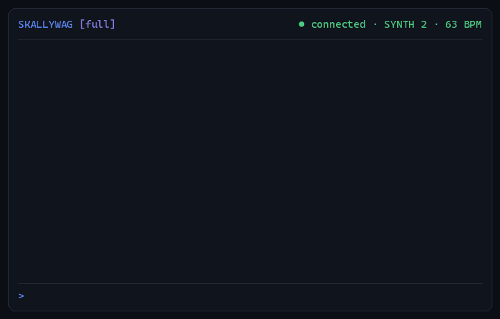
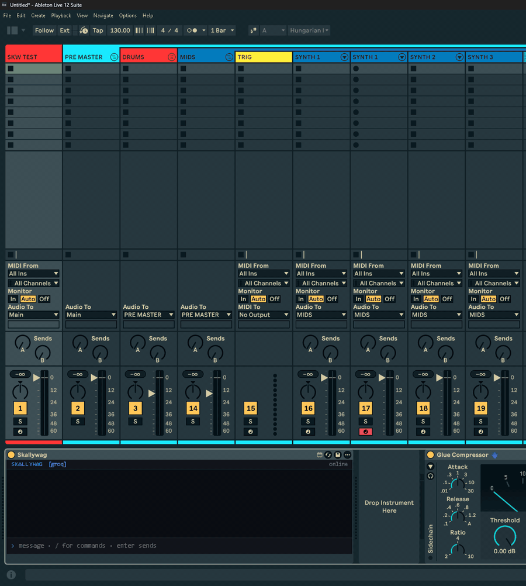

# Skallywag

**An AI first mate that lives in the channel bar of every lane in Ableton Live.**



Skallywag is a Max for Live device plus a small local agent. You type or say a concrete move and it writes the MIDI, builds and loops the clip, drops it on the Arrangement timeline at the bar you name, sets plugin parameters, drives the mixer, fires scenes. Every move is narrated in plain words with a lane emoji ("🥁 Doing the drums on KICK, channel 4") instead of raw code. It runs on your own machine: no account, no API key, works offline.

> The captain isn't always steering. Your first mate takes the order and turns the wheel. Skallywag is the first mate.

## It won't make you a banger

Skallywag is built for producers who already know the tools and the tactics. Vague, generative prompts are **rejected on purpose**. You have to say exactly what you want.

| Rejected | Accepted |
|---|---|
| `make me a banger in 140 deep dub` | `SUB 1: one note F1, bars 1–8, sidechain depth 0.7 on the SUB bus` |
| `make something dark and bouncy` | `C minor chord on SYNTH 2, 4 bars, offbeat 8ths, velocity 90` |
| `make a beat` | `house beat on track 3 at 124 bpm, 4 bars` |
| `write a hook` | `loop bars 33–41, Sampler on SYNTH 2 with a one-shot, one C3 held the full length` |

Missing one detail and it asks one question. Missing the idea and it sends you back to the drawing board.

Inside Live, on a lane, for real: tempo, a chord into a clip slot, then a Glue Compressor threshold found by reading the device chain first, then a vague prompt bounced.



**No AI-generated music. None.** Skallywag never generates a sound. It moves your sounds, writes the notes you asked for, and loads from your library. The idea is still yours. The hands are still yours.

## What's in this repo (free)

| Folder | What it is |
|---|---|
| `device-lite/` | **Skallywag Lite**, a free Max for Live audio effect: a live, color-coded activity terminal for whatever your scripts, OSC automation, or agents send it over UDP. |
| `claude/agents/` | 24 Claude Code channel agents (KICK, SNARE, HH, SYNTH 1–6, SUB, RISE, DOWN, VOX…) that drive one lane each through AbletonBridge. |
| `claude/skills/skallywag-template/` | The **THIS IS THE WAY** template map as a Claude Code skill: channel tree, post chains, drum-rack pads, locators, placement rules, and Skallywag's concrete-request rules. |
| `tools/osc.py` | The tiny OSC helper the channel agents call (AbletonOSC, port 11000/11001). |
| `install.ps1` / `install.sh` | One-line installers for the dependencies, the Lite device, the skills, and the paid bundle if you have it. |

The full Skallywag device, the local agent runtime, and the stacked template with mastered one-shots are the paid bundle: **https://4420607908526.gumroad.com/l/skallywag**

## Install

Windows (PowerShell):

```powershell
irm https://raw.githubusercontent.com/Moonwolf711/skallywag/main/install.ps1 | iex
```

macOS / Linux:

```bash
curl -fsSL https://raw.githubusercontent.com/Moonwolf711/skallywag/main/install.sh | bash
```

Node users, any platform:

```bash
npx github:Moonwolf711/skallywag
```

The installer:

1. Installs **Node.js LTS** and **Ollama** if they are missing (winget on Windows, Homebrew on macOS).
2. Downloads this repo and copies **Skallywag Lite** into your Ableton User Library (`Presets/Audio Effects/Max Audio Effect/Skallywag Lite`).
3. Copies the **channel agents and template skill** into `~/.claude` when Claude Code is installed.
4. Pulls the default local model (`qwen2.5:7b`, about 4.7 GB, one time).
5. If you point it at your purchased bundle (`-Zip path\to\Skallywag.zip` on Windows, `SKALLYWAG_ZIP=... ` on macOS), unpacks it to `Documents/Skallywag` and runs its setup.

Options are environment variables so they work with the one-liners: `SKALLYWAG_DRYRUN=1` prints every step without changing anything; `SKALLYWAG_SKIP_MODEL=1`, `SKALLYWAG_SKIP_SKILLS=1`, `SKALLYWAG_MODEL=qwen3:8b`, `SKALLYWAG_ZIP=<path>`.

## Requirements

| | Minimum | Recommended |
|---|---|---|
| Ableton | Live 11 or 12 with Max for Live | Live 12 |
| OS | Windows 10/11 x64 (macOS through the Ollama fallback) | |
| RAM | 16 GB | 32 GB |
| Disk | 6 GB for the brain; voice and eyes add ~4 GB | SSD |
| GPU | 8 GB VRAM, AMD, Intel or NVIDIA (llama.cpp Vulkan; CPU-only works, slowly) | 12 GB+ keeps brain, voice and eyes loaded together |
| Node.js | LTS | |

## Model backends

Skallywag ships pointed at a **local** model on your own graphics card (llama.cpp in `agent/brain`), so it works offline with no key. The tool schema and the rejection rules ship with the device and work with any tool-calling model, so nobody has to train anything to use a cloud model. Set one line in `agent/.env`:

| Backend | `.env` | Notes |
|---|---|---|
| Local (default) | `LLM_BACKEND=local` | The brain in `agent/brain` (llama.cpp Vulkan: AMD, Intel, NVIDIA). Offline. Qwen2.5-7B, or Qwen3-4B on 8 GB cards. |
| Ollama (fallback) | `LLM_BACKEND=local`, `SKW_BRAIN_BACKEND=off`, `LLM_MODEL=qwen2.5:7b` | When `agent/brain` is empty. Accelerates NVIDIA and a short list of AMD cards; CPU otherwise. |
| Groq (free tier) | `LLM_BACKEND=groq`, `GROQ_API_KEY=...` | Default model `openai/gpt-oss-120b`. Fast. Rate-limited on the free tier. |
| Muse Glimmer (local) | `LLM_MODEL=muse-glimmer` | Meta's 30B agent model, Apache 2.0, `ollama pull muse-glimmer`. Needs a 24 GB GPU or a 32 GB Apple Silicon Mac to be quick; runs on CPU otherwise, slowly. |
| Swarm | `LLM_SPEC=swarm:cascade:local:qwen2.5:7b,groq:openai/gpt-oss-120b` | One master, several models: `cascade` asks the first model and escalates only when its answer is not decisive; `vote` asks every member in parallel and takes the majority tool call. Members are any `local:` or `groq:` spec. |
| Claude, OpenAI, Gemini, xAI | API key for the provider | Pay per token with the provider's **API key**. Consumer subscriptions (Claude Max, ChatGPT plans) are not usable from third-party tools under those services' terms. |

**Brain.** The model runs on your own graphics card through llama.cpp (MIT; the Vulkan build runs AMD, Intel and NVIDIA alike, where Ollama accelerates only a short list of AMD cards). `agent/brain/get-brain.bat` fetches the engine and Qwen2.5-7B-Instruct (Apache-2.0, official Q4_K_M GGUF, ~4.7 GB); `get-brain.bat small` adds Qwen3-4B-Instruct for 8 GB cards, and the agent picks the model that fits the card whole. Tool calls are grammar-constrained by llama-server itself, a concrete order must open with a move, and a reply that comes back as JSON or a wall of text is rewritten once under a one-line grammar. Ollama stays a fallback (`SKW_BRAIN_BACKEND=off`); a Groq key stays optional for speed.

**Voice.** Davy talks back. Offline by default: `agent/voice/get-voice.bat` fetches a small speech engine (qwentts.cpp, MIT; Vulkan on AMD, Intel or NVIDIA, CPU otherwise) and the Qwen3-TTS model (Apache-2.0), and `make-voice.bat clip.wav name` clones a voice you have the right to use from a 15–30 s recording. ElevenLabs stays optional: `ELEVENLABS_API_KEY=` in `agent/.env`, `SKW_VOICE_ID=` for a voice from your account. `/voice off` mutes him.

**Eyes.** Live exposes no hover and no Info View text to plugins, so Davy has his own: `agent/eyes/get-eyes.bat` fetches llama.cpp (MIT) and Qwen3-VL (Apache-2.0, 2B for 8 GB cards, `get-eyes.bat big` for the 4B). `/look` reads the device view at native resolution: plugin GUIs, knob values, error text. Point at any control and press **Ctrl+Alt+E**: Davy names it, looks it up in his help book and explains it out loud. When a question depends on what is on screen ("what's that dialog?") the brain calls the eyes itself. Screenshots never leave your machine; the model loads on the first look and closes after 90 s idle so the voice keeps the GPU.

**Ears** (sold separately). Talk to him through Live. `device/Skallywag Ears.amxd` is a second, tiny device: drop it on an audio track whose Audio From is your microphone, arm the track, speak. The device watches the track's input for speech, cuts each utterance to a wav, and the agent transcribes it on your machine (`agent/ears/get-ears.bat` fetches whisper.cpp, MIT, and Whisper small.en, ~200 MB, CPU) and treats the words exactly like a typed order: same tools, same narration, same snark for vague talk, answered in the Ears panel and out loud. It records nothing while the track is disarmed or while Davy is talking. With `GROQ_API_KEY` set, `SKW_EARS_BACKEND=groq` uses Groq's Whisper instead (no download; audio leaves the machine). `/ears` shows what it is doing.

Deepest integration: Claude through Claude Code with the AbletonBridge MCP and the template skill in this repo. The Skallywag drive edition (limited run) ships a model fine-tuned on this exact tool set and template so it runs reliably at small size, offline.

## Who is on deck

The first time the device opens it asks four quick questions: how many years you have been producing, whether you run stock, third-party or hybrid plugins, whether you master your own tracks, and whether you start from a template. The answers stay on your machine and tune the first mate: a beginner who is vague gets one concrete example of what to say inside the refusal, a 10-year producer gets one terse line, third-party users get a plugin's parameters read before any is set, and producers who send their tracks out never get the master bus touched unasked. `/intro` asks again.

## Davy, the first mate

An 8-bit pirate lives in the device panel with a thought bubble. Hover his controls and he explains them. Click any knob or device in Live, then type `/explain` (or click Davy) and he dictates a proper note on it: what it does, how it behaves as you move it, one practical tip, spoken aloud when a voice is on. Ableton exposes no hover or Info View text to plugins, so this is click-driven by design and goes deeper than the built-in info box.

Every stock Live 12 device and parameter ships with a note in `agent/help.json`. Anything Davy does not know, third-party plugins included, he works out from the device type and the generic meaning of the control, writes a note, saves it, and knows it next time. Hand-written notes in that file are never overwritten.

Ask him for a banger and he needles you for it — "Sounds like ye haven't sailed the seven seas yet. Pollywogs point at a channel and count bars" — and still tells you exactly what he needs: the channel, the bars, the move.

## Your template, mapped

Skallywag ships knowing the THIS IS THE WAY layout, but it can learn yours. Type `/map` at the chat bar and it reads the set that is open through the device: every lane with its type, its inferred role (kick, snare/clap, hats, sub bass, pad, vocal, riser, reference...), the group it sits in, its device chain, the returns, the locators and the tempo. From then on "the sub" or "the kick lane" resolves without a lookup, and the map is saved under `agent/sets/` so `SKW_SET_MAP=sets/<name>.json` in `agent/.env` loads it at startup.

A Live set or template file works too, offline: `/map C:\path	o\MyTemplate.als` parses the gzipped XML directly. `/map show` prints the map, `/map off` drops it, `/map name <text>` renames it. The generic tools keep reading live indices, so a slightly stale map never breaks a move.

## The template

The paid bundle includes the **THIS IS THE WAY** Live set. The layout, so the agents and skill make sense:

```
PRE MASTER            Utility
├ DRUMS               Saturator
│  Drum Kit Full      full kit · KICK + SNARE samplers · HH · HH CLOSED · CRASH
│                     reverse-tail lanes · spice lane · mastered one-shots loaded
├ MIDS                EQ Eight high-pass → Saturator → ShaperBox 3
│  SYNTH 1 · 1b · 2 · 3   Serum 2 racks, LOW/HIGH split chains
│  SYNTH 4–6          resample lanes
├ SUB                 EQ Eight → ShaperBox 3 (sidechain shaping)
│  SUB 1              mono sub rack
├ FX                  RISE 1–3 · DOWN 1–3
└ VOCALS              VOX M · VOX F
REFERENCE             outside the bus, never processed
locators              INTRO 32 · DROP 128 · DROP 2 192 · DROP 3 288 · OUTRO 352
```

Every drum lane runs the same post rack: kHs Transient Shaper → Glue Compressor → Utility → Ozone Imager 2 → GClip. Tune it, don't replace it. Third-party plugins named there are not included.

## Using the channel agents (Claude Code)

The agents in `claude/agents/` each own one lane and talk to Live through the **AbletonBridge** MCP server (`mcp__AbletonBridge__*`) and the OSC helper in `tools/osc.py` (AbletonOSC on ports 11000/11001). Put `tools/osc.py` somewhere on your path or edit the helper line in each agent. Invoke one with, for example, `/agents track-kick` or by asking for "the KICK channel".

## License

Scripts, agents, and the skill in this repo are MIT licensed. Skallywag Lite is free to use in your own sets. The full device, agent, and template are sold separately under the Gumroad license.
